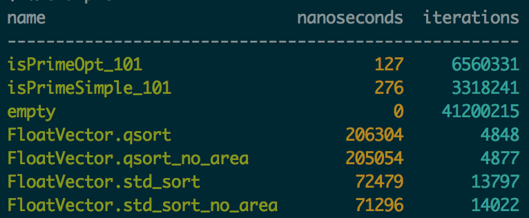

# zenbench - a minimal micro benchmark library
   * Header-only
   * Solely depends on a C++ 11 capable compiler

### Basic Usage
All benchmarks must be created and registered with the `BENCHMARK(name)` or the `BENCHMARK_F(fixture,name)` macro:

    BENCHMARK(isPrimeSimple_101)
    {
        while (ctxt.Running())
        {
            // put the code to benchmark here
            isPrimeSimple(101);
        }
    }
    
These macros register a benchmark in a global list and obtain a `zenbench::Context& ctxt` parameter which iterates
over the code to benchmark for a given amount of time.

To execute all benchmarks and print the results to stdout call `zenbench::Benchmark::RunAllBenchmarks()` (in `main`, e.g.).

    int main(int argc, const char* argv[])
    {
        zenbench::Benchmark::RunAllBenchmarks(argc, argv);   
    }
    
or add `ZENBENCH_MAIN` to the global scope. 
    
### Fixture Classes
Fixture classes must derive from `zenbench::Benchmark` and may overwrite `SetUp`and `TearDown`   
    
    class Fixture : public zenbench::Benchmark
    {
    protected:
        virtual void SetUp() override
        {
            zenbench::Benchmark::SetUp();
        
            // put your initialization code here
        }
    
        virtual void TearDown() override
        {
            // put your tear down code here
        
            zenbench::Benchmark::TearDown();
        }
    };

## Benchmark Areas
For some Benchmarks it is necessary to setup new input data in every iteration. To exclude this setup from the benchmark,
wrap the included parts in an additional scope and declare a `BenchmarkArea` object at the top of this scope.

    while (ctxt.Running())
    {
        // the copy of vec to workVector is not included in the Benchmark
        std::vector<float> workVector(size);
        std::copy(vec.begin(),vec.end(),workVector.begin());
        
        {
            zenbench::BenchmarkArea benchArea(ctxt);
    
            qsort(workVector.data(),size,sizeof(float),cmp_float);
        }
    }

## Benchmark Filter
Pass `--zenbench_filter=*foo*` to restrict the execution to benchmarks which names or fixtures contain `foo`.

## Example Output
